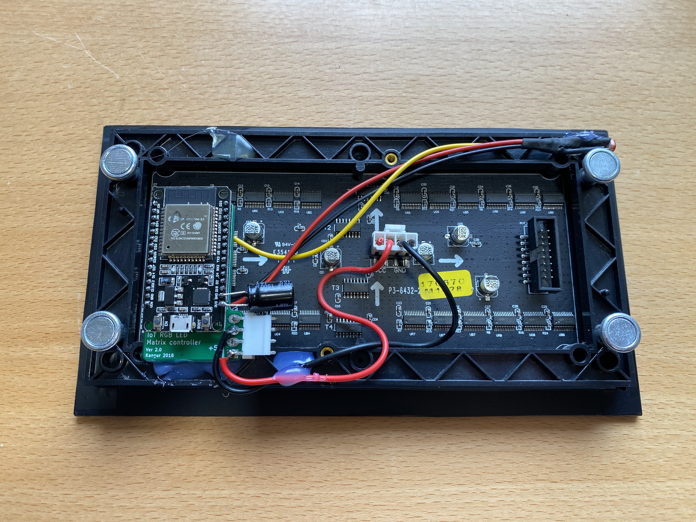

# ESP32-RGB-LED-Matrix-Clock
ESP32 based RGB-LED-Matrix WiFi Clock with MQTT sourced room and outside temperature display and date. Automatic brightness control based on LDR

# Features:
- displays Time HH:MM:SS
- displays date
- displays 2 temperatures from MQTT server: i.e. room and outside
- Brightness control with LDR
- NTP timesource
- timezone changable
- firmware updatable over the air (HTTP webserver)
- 5V/1A USB powersupply
- power consumtion average is about 1.3W

PCB was sourced from this design:
https://hackaday.io/project/28945-iot-rgb-led-matrix-controller-esp32

Display:
search for "indoor 3mm led module full color 32*64 96mm*192mm hub75 1/16S rgb dot matrix p3" at aliexpress
https://www.aliexpress.com/item/32651977545.html

ESP32 NodeMCU:

https://www.pollin.de/p/joy-it-esp32-node-mcu-modul-810873

HUB75 DMA library used:
https://github.com/mrfaptastic/ESP32-HUB75-MatrixPanel-DMA

# Final Pictures

Wall mounted:

With acrylic front plate (30% light transfer):

Backside:

LDR detail:

Acrylic front plate is mounted with black PVC tape :-)
